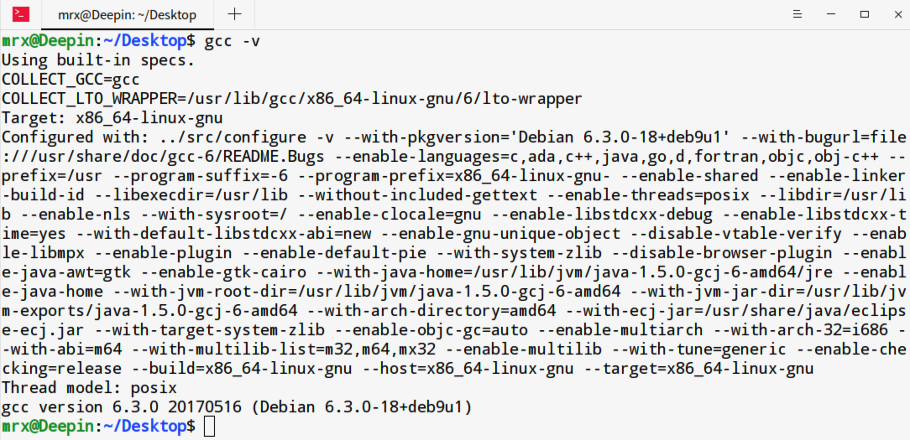

### C Environment Setup

在开始之前，需要确保你的电脑上有文本编辑器和C编译器。

文本编辑器比如：Notepad、Vim、VsCode等。

C编译器本书使用GNU C/C++。

#### (1)Linux下安装GNU C/C++

Linux或Unix默认安装了该编译器、可通过以下命令进行查看：

```bash
mrx@Deepin:~/Desktop$ gcc -v
```

显示结果如下：



如果未安装，详细安装步骤请参考：http://gcc.gnu.org/install。

#### (2)MacOS下安装GNU C/C++

MaxOS安装GCC最简单的方式就是直接安装XCode开发环境。XCode可直接应用商店下载即可。

```bash
➜  ~ gcc -v
Apple clang version 13.1.6 (clang-1316.0.21.2.5)
Target: x86_64-apple-darwin21.6.0
Thread model: posix
InstalledDir: /Applications/Xcode.app/Contents/Developer/Toolchains/XcodeDefault.xctoolchain/usr/bin
```

#### (3)Windows下安装GNU C/C++

Windows下安装GCC需要安装MinGW。具体安装步骤请参考：https://mingw.osdn.io。


