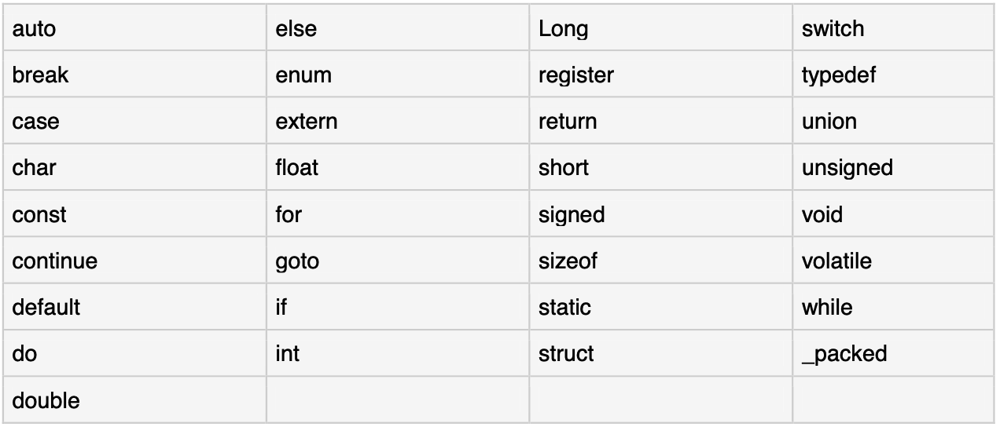

### C Basic Syntax

#### (1)C中的标记

一个C程序由若干标记(token)组成，标记可以是关键字(keyword)、标识符(identifier)、常量(constant)、字符串文字(string literal)或符号(symbol)。

比如，以下C语句由5个标记组成。

```c
printf("Hello World! \n");
```

5个标记拆分开是：

```c
printf
(
"Hello World! \n"
)
;
```

#### (2)分号

在C程序中，分号(Semicolons)是语句终止符。也就是说，每个单独语句都必须以分号结尾，它表示一个逻辑实体的结束。

例如，以下是两个不同的语句：

```c
printf("Hello World! \n");
return 0;
```

#### (3)注释

注释(Comments)就行C程序中的帮助文本，编译器会忽略它们。

单行注释`//`。如下所示：

```c
// my first program in C
```

多行注释，以`/*`开头并且以`*/`结尾。如下所示：

```c
/* my first program in C */
```

#### (4)标识符

C标识符(Identifiers)用于标识变量，函数或者任何其他用户定义项的名称。C标识符以字母`A到Z`、或`a到z`、或`下划线_`开头，后面跟零个或多个字母，下划线和数字(`0~9`)。

C不允许在标识符(Identifiers)中使用标点符号，比如"@"、"$"和"%"。C是一种区分大小写的编程语言。因此，"Manpower"和"manpower"是C中两个不同的标识符。以下是一些可接受的标识符示例：

```asciiarmor
mohd       zara    abc   move_name  a_123
myname50   _temp   j     a23b9      retVal
```

#### (5)保留字

以下列表显示了C中的保留字。这些保留字不能用作常量或变量或任何其他标识符名称。



#### (6)C中的空格

仅包含空格的行(可能带有注释)称为空行，C编译器会完全忽略它。

空格(Whitespace)是C语言中用来描述空格、制表符、换行符和注释的术语。空格将语句的一部分与另一部分分开，并使编译器能够识别语句中的一个元素(比如:int)在哪里结束，而下一个元素在哪里开始。因此，在以下语句中，int 和 age 之间必须至少有一个空白字符(通常是空格)，以便编译器能够区分它们。

```c
int age;
```

另一方面，在下面的声明中：`fruit`和`=`之间，或者`=`和`apples`之间不需要空格字符，尽管如果希望出于可读性目的，可以随意包含一些空格字符。

```c
fruit = apples + oranges;   // get the total fruit
```

