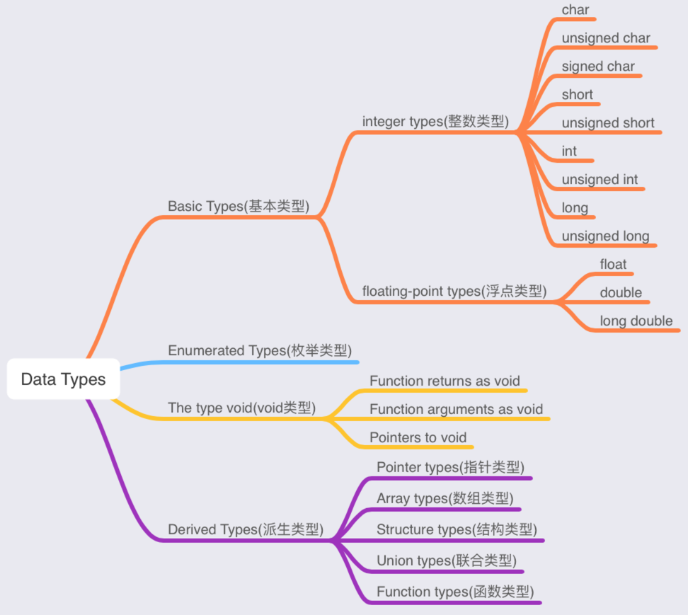

### Data Types

在C语言中，数据类型(Data Types)是指用于声明不同类型的变量或函数的扩展系统。变量的类型决定了它在存储中占用了多少空间以及如何解释存储的位模式。

C中的数据类型可以分类如下：

| S.N. | Types and Description                                        |
| ---- | ------------------------------------------------------------ |
| 1    | **Basic Types(基本类型):**<br/>它们都是算数类型。包含两种类型：整数类型(integer types)和浮点类型(floating-point types) |
| 2    | **Enumerated types(枚举类型):**<br/>它们都是算数类型。它们用于定义在整个程序中只能分配某些离散整数值的变量。 |
| 3    | **The type void(void类型):**<br/>类型说明符void。表示没有可用的值。 |
| 4    | **Derived Types(派生类型):**<br/>它们包括：指针类型(Pointer types)、数组类型(Array types)、结构类型(Structure types)、联合类型(Union types)和函数类型(Function types)。 |

数组类型和结构类型统称为聚合类型。函数类型指的是函数的返回值类型。本节仅介绍`Basic Types(基本类型)`和`The type void(void类型)`，其它类型后续再讲解。

#### (1)基本类型(整数类型)

下表列出了标准整数类型(Integer Types)及其存储大小和取值范围的详细信息。

| Type           | Storage size | Value range                                             |
| -------------- | ------------ | ------------------------------------------------------- |
| char           | 1 byte       | -128 to 127 或者 0 to 255                               |
| unsigned char  | 1 byte       | 0 to 255                                                |
| signed char    | 1 byte       | -128 to 127                                             |
| short          | 2 byte       | -32,768 to 32,767                                       |
| unsigned short | 2 byte       | 0 to 65,535                                             |
| int            | 4 byte       | -32,768 to 32,767                                       |
| unsigned int   | 4 byte       | 0 to 65,535                                             |
| long           | 8 byte       | -9,223,372,036,854,775,808 to 9,223,372,036,854,775,807 |
| unsigned long  | 8 byte       | 0 to 18,446,744,073,709,551,615                         |

默认情况下，short、int和long都是有符号的。

因为各种存储类型的存储大小与系统位数有关，故以上的存储大小和取值范围仅为参考。如果需要在特定平台上获取某个数据类型或者变量的具体大小，可以使用`sizeof`运算符。表达式`sizeof(type)`可以得到对象或存储类型的存储字节大小。

以下是在任何机器上获取上述表中类型大小的示例：

```c
#include <stdio.h>
#include <limits.h>

int main(){
    printf("Storage size for char: %d \n", sizeof(char));
    printf("Storage size for unsigned char: %d \n", sizeof(unsigned char));
    printf("Storage size for signed char: %d \n", sizeof(signed char));
    printf("\n");

    printf("Storage size for short: %d \n", sizeof(short));
    printf("Storage size for unsigned short: %d \n", sizeof(unsigned short));
    printf("\n");

    printf("Storage size for int: %d \n", sizeof(int));
    printf("Storage size for unsigned int: %d \n", sizeof(unsigned int));
    printf("\n");

    printf("Storage size for long: %d \n", sizeof(long));
    printf("Storage size for unsigned long: %d \n", sizeof(unsigned long));
    return 0;
}
```

程序运行结果：

```
$ gcc -o get_size1 get_size1.c 
$ ./get_size1 

Storage size for char: 1 
Storage size for unsigned char: 1 
Storage size for signed char: 1 

Storage size for short: 2 
Storage size for unsigned short: 2 

Storage size for int: 4 
Storage size for unsigned int: 4 

Storage size for long: 8 
Storage size for unsigned long: 8 
```

#### (2)基本类型(浮点类型)

下表详细介绍了标准浮点类型(Floating-Point Types)及其存储大小和取值范围以及其精度的详细信息。

| Type        | Storage size | Value range                    | Precision    |
| ----------- | ------------ | ------------------------------ | ------------ |
| float       | 4 byte       | 1.175494E-38 to 3.402823E+38   | 6位有效数字  |
| double      | 8 byte       | 2.225074E-308 to 1.797693E+308 | 15位有效数字 |
| long double | 16 byte      | 1.797693E+308 to 1.797693E+308 | 18位有效数字 |

头文件`float.h`中定义了允许我们在程序中使用这些值和有关实数二进制表示的其他详细信息的宏。以下示例将打印浮点类型及其范围值占用的存储空间：

```c
#include <stdio.h>
#include <float.h>

int main(){
    printf("Storage size for float: %d \n", sizeof(float));
    printf("Minimum float positive value: %E\n", FLT_MIN);
    printf("Maximum float positive value: %E\n", FLT_MAX);
    printf("Precision value: %d\n", FLT_DIG);
    printf("\n");

    printf("Storage size for double: %d \n", sizeof(double));
    printf("Minimum double positive value: %E\n", DBL_MIN);
    printf("Maximum double positive value: %E\n", DBL_MAX);
    printf("Precision value: %d\n", DBL_DIG);
    printf("\n");

    printf("Storage size for long double: %d \n", sizeof(long double));
    printf("Minimum long double positive value: %E\n", LDBL_MIN);
    printf("Maximum long double positive value: %E\n", LDBL_MAX);
    printf("Precision value: %d\n", LDBL_DIG);
    printf("\n");

    return 0;
}
```

程序运行结果：

```
$ gcc -o get_size2 get_size2.c
$ ./get_size2           

Storage size for float: 4 
Minimum float positive value: 1.175494E-38
Maximum float positive value: 3.402823E+38
Precision value: 6

Storage size for double: 8 
Minimum double positive value: 2.225074E-308
Maximum double positive value: 1.797693E+308
Precision value: 15

Storage size for long double: 16 
Minimum long double positive value: 1.797693E+308
Maximum long double positive value: 1.797693E+308
Precision value: 18
```

#### (3)void类型

void类型指定没有可用的值。它通常用于以下三种情况：

| S.N. | Type and Description                                         |
| ---- | ------------------------------------------------------------ |
| 1    | **Function returns as void(函数返回值为void):**<br>C中有很多不返回值的函数，没有返回值的函数的返回类型为void。<br>例如：void exit(int status); |
| 2    | **Function arguments as void(函数参数为void):**<br>C中有很多不接受任何参数的函数，没有任何参数的函数可以接受void类型。<br>例如：int rand(void); |
| 3    | **Pointers to void(指针指向为void):**<br>`void *`类型的指针可以表示对象的地址，但不表示其类型。<br>例如：void *malloc(size_t size); 这会返回指向void的指针，该指针可以转换为任何数据类型。 |

此时如果无法理解 void 类型，我们还会在接下来的章节中介绍这些内容。

汇总后的C数据类型如下：




