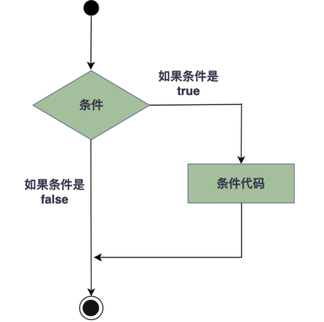
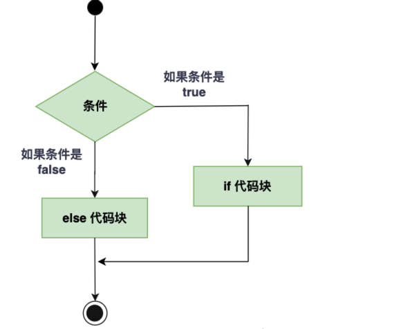
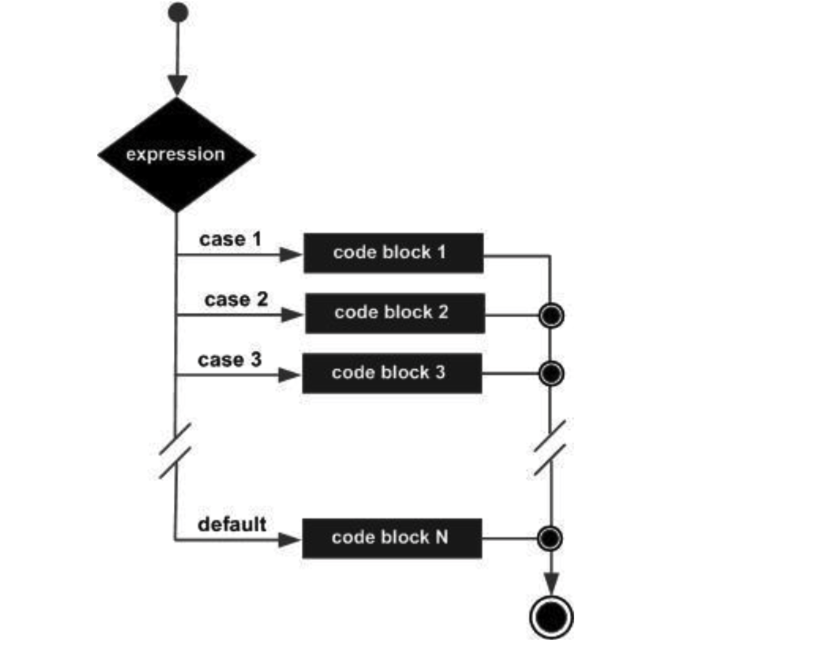

### Decision Making in C

决策结构(Decision Making)要求程序员指定一个或多个要评估或测试的条件，以及如果条件为真时要执行的一个或多个语句，以及可选地，如果条件被确定为假时要执行的其他语句。

以下是在大多数编程语言中发现的典型决策结构的一般形式：



C语言把任何非零和非空值假定为真(True)，把零和空值(null)假定为假(False)。

C语言提供了以下类型的决策结构。

#### (1)if语句

if语句由一个布尔表达式后跟一个或多个语句组成。

C语言中if语句的语法如下：

```c
if(boolean_expression){
  //如果布尔表达式为真，将执行的语句
}
```

如果布尔表达式结果为真，则if语句内的代码块将会被执行。如果布尔表达式结果为假，则if语句结束后的第一组代码(闭括号后)将被执行。


示例代码：

```c
#include <stdio.h>

int main(){

	int a = 10;

	if(a < 20){
		printf("a is less than 20.\n");
	}
	printf("Exact value of a is : %d\n", a ); 

	return 0;
}
```

执行结果：

```bash
$ gcc -o test1 test1.c
$ ./test1
a is less than 20.
Exact value of a is : 10
```

#### (2)if...else语句

if语句后面可跟可选的else语句，else语句在当布尔表达式为False时执行。

C语言中if...else语句的语法如下：

```c
if(boolean_expression){
  //如果布尔表达式为真，将执行的语句
}else{
  //如果布尔表达式为假，将执行的语句
}
```



示例代码：

```c
#include <stdio.h>

int main(){

	int a = 100;

	if(a < 20)
	{
		printf("a is less than 20.\n");
	}else{
		printf("a is not less than 20.\n");
	}
	printf("Exact value of a is : %d\n", a ); 

	return 0;
}
```

运行结果：

```bash
$ cc -o test2 test2.c
$ ./test2
a is not less than 20.
Exact value of a is : 100
```

#### (3)if...else if...else语句

if语句后面可跟可选的else if...else语句，这可用于测试多种条件。

当使用if...else if...else语句时，需要注意：一旦某个 else if 匹配成功，其他的 else if 或 else 将不会再被执行。

C语言中if...else if...else语句的语法如下：

```c
if(boolean_expression 1){
  //如果 布尔表达式1 为真，将执行的语句
}else if(boolean_expression 2){
  //如果 布尔表达式2 为真，将执行的语句
}else if(boolean_expression 3){
  //如果 布尔表达式3 为真，将执行的语句
}else{
  //如果布尔表达式都为假，将执行的语句
}
```

示例代码：

```c
#include <stdio.h>

int main(){

	int a = 100;

	if(a == 10){
		printf("Value a is 10.\n");
	}else if(a == 20){
		printf("Value a is 20.\n");
	}else if(a == 30){
		printf("Value a is 30.\n");
	}else{
		printf("None of the values is matching.\n");
	}
	printf("Exact value of a is %d.\n", a);

	return 0;
}
```

运行结果：

```bash
$ gcc -o test3 test3.c
$ ./test3
None of the values is matching.
Exact value of a is 100.
```

#### (4)嵌套if语句

在C语言中，嵌套if-else语句是合法的，这意味着你可以在一个if或else if语句中使用另一个if或else if语句。

C语言中嵌套if语句的语法如下：

```c
if(boolean_expression 1)
{
   //如果 布尔表达式1 为真，将执行的语句
   if(boolean_expression 2)
   {
       //如果 布尔表达式2 为真，将执行的语句
   }
}
```

示例代码：

```c
#include <stdio.h>

int main(){

	int a = 100;
	int b = 200;

	if(a == 100){
		if(b == 200){
			printf("Value of a is 100 and b is 200\n" );
		}
	}

	printf("Exact value of a is : %d\n", a ); 
	printf("Exact value of b is : %d\n", b );
	return 0;
}
```

运行结果：

```bash
$ gcc -o test4 test4.c
$ ./test4
Value of a is 100 and b is 200
Exact value of a is : 100
Exact value of b is : 200
```

#### (5)switch语句

switch语句允许测试一个变量等于多个值时的情况。每个值称为一个case，被测试的变量会对每个switch case进行检查。

C语言中switch语句的语法如下：

```c
switch(expression){
    case constant-expression  :
       statement(s);
       break;
    case constant-expression  :
       statement(s);
       break; 
    /* you can have any number of case statements */
    default :
       statement(s);
}
```

switch语句必须遵循下面的规则：

- switch语句中的expression是一个常量表达式，必须是一个整型或枚举类型。
- switch语句中可以有任意数量的case语句。每个case后跟一个要比较的值和一个冒号。
- case的constant-expression必须与switch(expression)中的expression具有相同的数据类型，且必须是一个常量或字面量。
- 当被测试的变量等于case中的常量时，case后跟的语句将被执行，直到遇到break语句为止。
- 当遇到break语句时，switch语句终止，控制流将跳出switch语句，然后执行程序剩下的代码。
- 不是每一个case都需要包含break。如果case语句不包含break，控制流将会继续执行switch中后续的case，直到遇到break为止。
- switch语句可以有一个可选的default case，出现在switch语句的结尾。default case可用于在上面所有 case 都不为真的时候执行一个任务。default case中的break语句不是必需的。



示例代码：

```c
#include <stdio.h>


int main(){

	char grade = 'B';

	switch(grade){
		case 'A':
			printf("Excellent!\n");
			break;
		case 'B':
		case 'C':
			printf("Well done.\n");
			break;
		case 'D':
			printf("You passed.\n");
			break;
		case 'E':
			printf("Better try again.\n");
			break;
		default:
			printf("Invalid grade.\n");
	}
	printf("Your grade is %c.\n", grade);
	return 0;
}
```

 运行结果：

```bash
$ ./test5
Well done.
Your grade is B.
```

#### (6)嵌套switch语句

您可以把一个switch作为一个外部switch语句序列的一部分，即可以在一个switch语句内使用另一个switch语句。即使内部和外部switch的case常量包含共同的值，也没有矛盾。

C语言中嵌套switch语句的语法如下：

```c
switch(ch1) {
   case 'A':
      printf("This A is part of outer switch" );
      switch(ch2) {
         case 'A':
            printf("This A is part of inner switch" );
            break;
         case 'B': /* case code */
      }
      break;
   case 'B': /* case code */
}
```

示例代码：

```c
#include <stdio.h>

int main(){
	int a = 100;
	int b = 200;

	switch(a){
		case 100:
			printf("This is part of outer switch.\n");
			switch(b){
				case 200:
					printf("This is part of inner switch.\n");
					break;
			}
			break;
	}
	printf("Exact value of a is: %d.\n", a);
	printf("Exact value of b is: %d.\n", b);

	return 0;
}
```

运行结果：

```bash
$ gcc -o test6 test6.c
$ ./test6
This is part of outer switch.
This is part of inner switch.
Exact value of a is: 100.
Exact value of b is: 200.
```

#### (7)?:运算符(三元运算符)

在前面的小节中我们讲解了`条件运算符?:`，可以用来替代`if...else`语句。它的一般形式如下：

```asciiarmor
Exp1 ? Exp2 : Exp3
```

其中，Exp1、Exp2 和 Exp3 是表达式。需注意，冒号的使用和位置。

`?: 表达式`的值是由 Exp1 决定的。如果 Exp1 为真，则计算 Exp2 的值，结果即为整个表达式的值。如果 Exp1 为假，则计算 Exp3 的值，结果即为整个表达式的值。

示例代码：

```c
#include <stdio.h>

int main(){

	int num;
	printf("请输入一个整数: ");
	scanf("%d",&num);

	(num>10)?printf("输入的数值大于10.\n"):printf("输入的数值小于10.\n");
	return 0;
}
```

运行结果：

```	bash
$ gcc -o test7 test7.c
$ ./test7
请输入一个整数: 19
输入的数值大于10.
$ ./test7
请输入一个整数: 8
输入的数值小于10.
```


