### C Loops

有的时候，我们可能需要多次执行同一块代码。一般情况下，语句是按顺序执行的：函数中的第一个语句先执行，接着是第二个语句，依此类推。

编程语言提供了多种更为复杂执行路径的控制结构。

循环语句允许我们多次执行一条语句或一组语句，下面是在大多数编程语言中循环语句的一般形式：

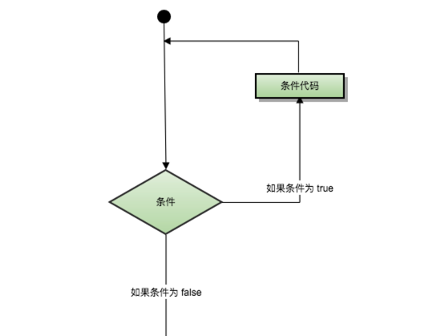

C语言提供以下类型的循环来处理循环要求。

#### (1)while循环

只要给定的条件为真，C语言中的while循环就会重复执行目标语句。

C语言中while循环语句的语法如下：

```c
while(condition)
{
   statement(s);
}
```

在这里，**statement(s)**可以是一个单独的语句，也可以是几个语句组成的代码块。

**condition**可以是任意的表达式，当为任意非零值时都为true。

当条件为true时执行循环，当条件为false时，退出循环，程序流将继续执行紧接着循环的下一条语句。

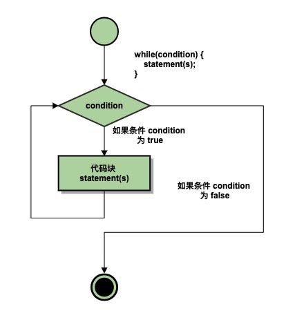

在这里，while循环的关键点是循环可能永远都不会被执行。当条件为false时，循环主体会被跳过，并且紧接着while循环后的下一条语句就会被执行。

示例代码：

```c
#include <stdio.h>

int main(){

	int a = 10;

	while(a < 20){
		printf("Value a is: %d.\n", a);
		a++;
	}

	return 0;
}
```

运行结果：

```bash
$ gcc -o test1 test1.c
$ ./test1
Value a is: 10.
Value a is: 11.
Value a is: 12.
Value a is: 13.
Value a is: 14.
Value a is: 15.
Value a is: 16.
Value a is: 17.
Value a is: 18.
Value a is: 19.
```

#### (2)for循环

for循环是一种重复控制结果，它允许你编写一个需要执行特定次数的循环。

C语言中for循环语句的语法如下：

```c
for(init; condition; increment){
    statement(s);
}
```

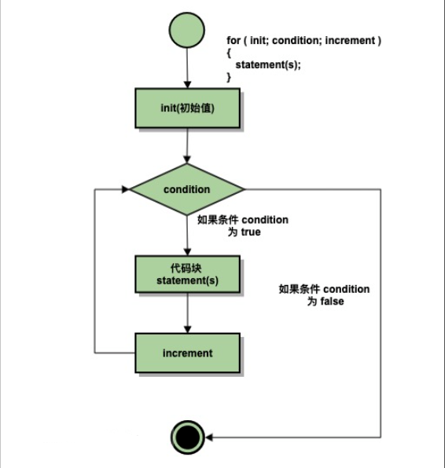

- `init`会首先被执行，且只执行一次。这一步允许你声明并初始化任何循环控制变量。你也可以不在这里写任何语句，只要有一个分号出现即可。
- 接下来，会判断`condition`。如果为真，则执行循环体内的语句；如果为假，循环体内的语句就不会执行，并且控制流会跳转到紧接着for循环的下一条语句。
- 在执行完for循环主体内的语句后，控制流会跳转回上面的`increment`语句。该语句允许你更新循环控制变量。你也可以不在这里写任何语句，只要在`condition`后有一个分号出现即可。
- `condition`会再次被判断。如果为真，则执行循环体内的语句。这个过程会不断重复（循环主体，然后更新循环控制变量，再重新判断条件）。如果为假，循环体内的语句就不会执行，并且控制流会跳转到紧接着for循环的下一条语句。

示例代码：

```c
#include <stdio.h>

int main(){

	for(int a=10; a < 20; a=a+1){
		printf("Value of a is: %d.\n", a);
	}

	return 0;
}
```

运行结果：

```bash
$ gcc -o test2 test2.c
$ ./test2
Value of a is: 10.
Value of a is: 11.
Value of a is: 12.
Value of a is: 13.
Value of a is: 14.
Value of a is: 15.
Value of a is: 16.
Value of a is: 17.
Value of a is: 18.
Value of a is: 19.
```

#### (3)do...while循环

在C语言中，`for`和`while`循环的循环判断条件(condition)在循环头部；`do...while`循环的循环判断条件(condition)在循环尾部。

C语言中do...while循环语句的语法如下：

```c
do{
  statement(s);
}while(condition);
```

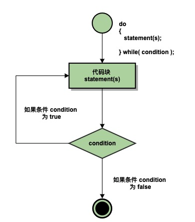

需要注意的是，条件表达式`condition`在代码的尾部，所以该循环体中的代码块`statement(s)`在条件被测试之前至少执行一次。

如果条件为真，控制流就会跳转回上面的do，然后重新执行循环体中的`statement(s)`。这个过程会不断重复，知道给定的条件变为假为止。

示例代码：

```c
#include <stdio.h>

int main(){

	int a = 10;

	do{
		printf("Value of a is: %d.\n", a);
		a = a + 1;
	}while(a < 20);

	return 0;
}
```

运行结果：

```bash
$ gcc -o test3 test3.c
$ ./test3
Value of a is: 10.
Value of a is: 11.
Value of a is: 12.
Value of a is: 13.
Value of a is: 14.
Value of a is: 15.
Value of a is: 16.
Value of a is: 17.
Value of a is: 18.
Value of a is: 19.
➜  11-C Loops
```

#### (4)嵌套循环

C语言允许在一个循环内使用另一个循环。

C语言中`嵌套for循环`语句的语法如下：

```c
for(init; condition; increment){
	for(init; condition; increment){
        statement(s);
    }
    statement(s);
}
```

C语言中`嵌套while循环`语句的语法如下：

```c
while(condition){
    while(condition){
        statement(s);
    }
    statement(s);
}
```

C语言中`嵌套do...while循环`语句的语法如下：

```c
do{
	statement(s);
    do{
        statement(s);
    }while(condition);
}while(condition);
```

关于嵌套循环有一点需要注意：你可以在任意类型的循环内嵌套其他任何类型的循环。比如，一个for循环可以嵌套在一个while循环中，反之亦然。


#### (5)break语句

C语言中break语句由两种用法：

- break语句出现在一个循环内时，循环会立即终止，写程序控制流将继续执行紧接着循环的下一条语句。
- break语句可以用于终止switch语句中的一个case。

C语言中`break`语句的语法如下：

```c
break;
```

break跳出while循环：

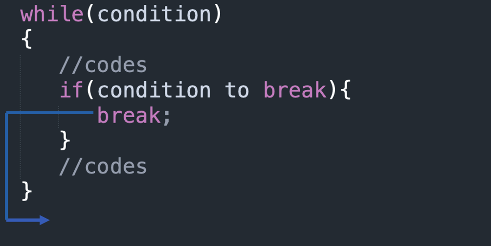

break跳出do...while循环：

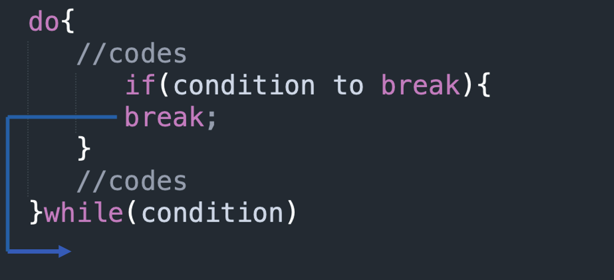

break跳出for循环：

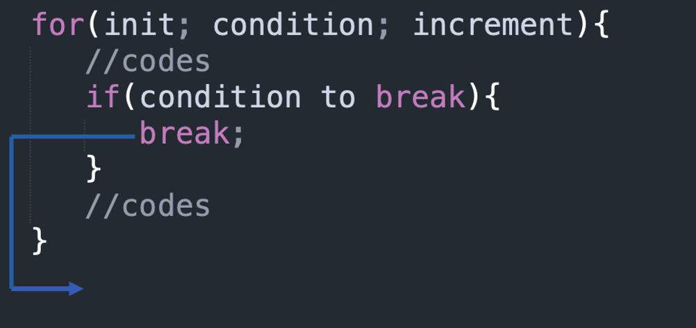

示例代码：

```c
#include <stdio.h>

int main(){

	int a = 10;

	while(a < 20){
		printf("Value of a is: %d.\n", a);
		a++;
		if(a > 15){
			break;
		}
	}

	return 0;
}
```

运行结果：

```c
$ gcc -o test4 test4.c
$ ./test4
Value of a is: 10.
Value of a is: 11.
Value of a is: 12.
Value of a is: 13.
Value of a is: 14.
Value of a is: 15.
```

#### (6)continue语句

C中的continue语句和break语句类似，但它直接跳出循环，continue会跳出本次循环，接着开始执行下一次循环。

对于 while 和 do...while 循环，continue 语句会跳转重新执行条件判断语句。

对于 for 循环，continue 语句执行后会跳转重新执行条件判断语句，循环控制变量语句仍然会被执行。

C语言中`continue`语句的语法如下：

```c
continue;
```

continue跳出while的本次循环执行下一次循环：

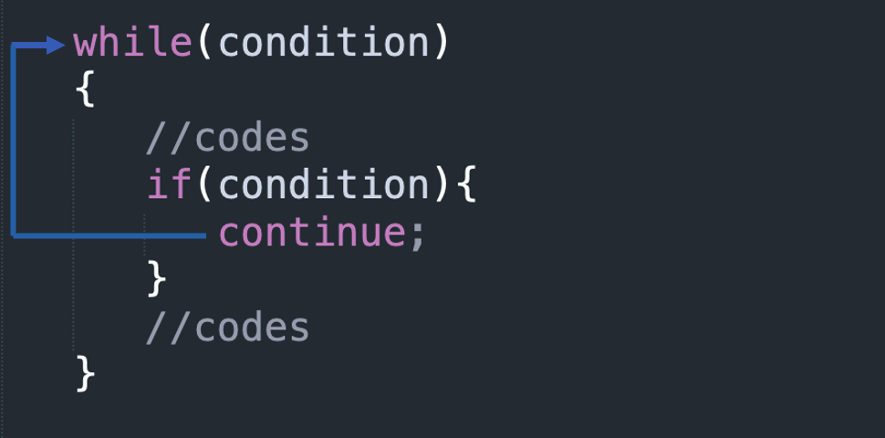

continue跳出do...while的本次循环执行下一次循环：

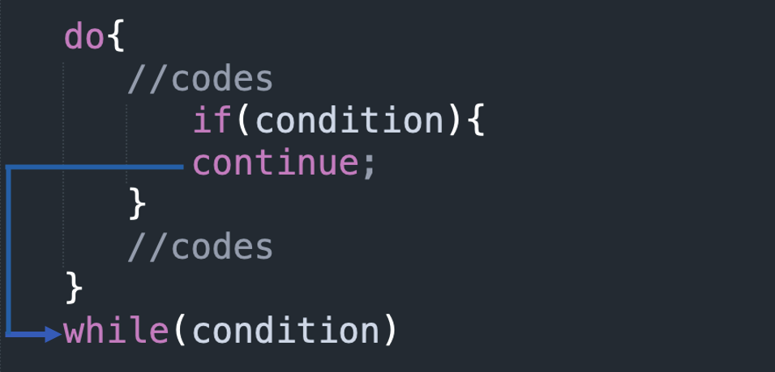

continue跳出for的本次循环执行下一次循环：

> 对于for循环，continue语句执行后，循环控制变量语句仍然会执行。

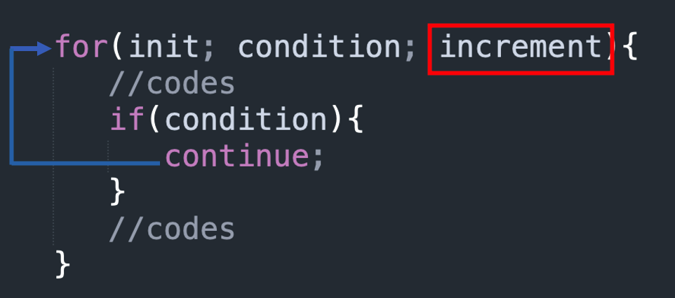

示例代码：

```c
#include <stdio.h>

int main(){

	int a = 10;

	do{
		if(a == 15){
			a = a + 1;
			continue;
		}
		printf("Value of a is: %d.\n", a);
		a = a + 1;
	}while(a < 20);

	return 0;
}
```

运行结果：

```bash
$ gcc -o test5 test5.c
$ ./test5
Value of a is: 10.
Value of a is: 11.
Value of a is: 12.
Value of a is: 13.
Value of a is: 14.
Value of a is: 16.
Value of a is: 17.
Value of a is: 18.
Value of a is: 19.
```

#### (7)goto语句

C 语言中的`goto`语句允许把控制流无条件的转移到同一函数内的被标记的语句处。

注意：在任何编程语言中，都不建议使用goto语句。因为它使得程序的控制流难以跟踪，使程序难以理解和难以修改。任何使用goto语句的程序可以改写成不需要使用goto语句的写法。

C语言中`goto`语句的语法如下：

```c
goto label;
...
...
label statement;
```

在这里，"label"可以是任何除 C 关键字以外的任何纯文本，它可以设置在 C 程序中 goto 语句的前面或者后面任何位置。

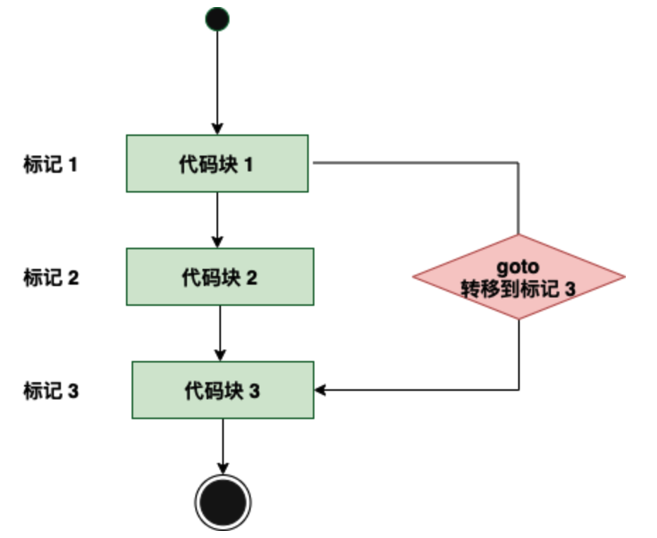

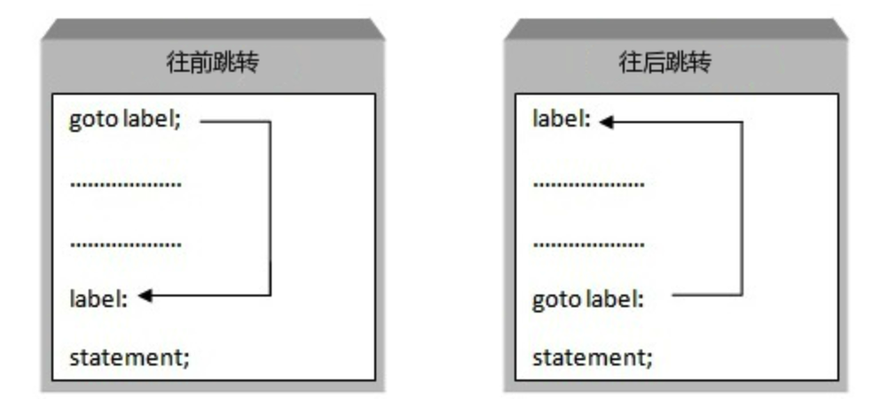

示例代码：

```c
#include <stdio.h>

int main(){

	int a = 10;

	LOOP:do{
		if(a == 15){
			a = a + 1;
			goto LOOP;
		}
		printf("Value of a is: %d.\n", a);
		a++;
	}while(a < 20);

	return 0;
}
```

运行结果：

```bash
$ gcc -o test6 test6.c
$ ./test6
Value of a is: 10.
Value of a is: 11.
Value of a is: 12.
Value of a is: 13.
Value of a is: 14.
Value of a is: 16.
Value of a is: 17.
Value of a is: 18.
Value of a is: 19.
```

#### (8)无限循环

如果条件永远不为假，则循环将变成无限循环。

**for**循环在传统意义上可用于实现无限循环。由于构成循环的三个表达式中任何一个都不是必需的，因此可以将某些条件表达式留空来构成一个无限循环。

```c
#include <stdio.h>

int main(){
    
    for( ; ; ){
        printf("This loop will run forever.\n");
    }
    
    return 0;
}
```

运行结果：

```bash
$ gcc -o test7 test7.c
$ ./test7
This loop will run forever.
This loop will run forever.
This loop will run forever.
This loop will run forever.
This loop will run forever.
This loop will run forever.
This loop will run forever.
...
...
```

> 当条件表达式不存在时，它被假设为真。你也可以设置一个初始值和增量表达式，但是一般情况下，C 程序员偏向于使用 for(;;) 结构来表示一个无限循环。可以按 **Ctrl + C** 键终止一个无限循环。

### 