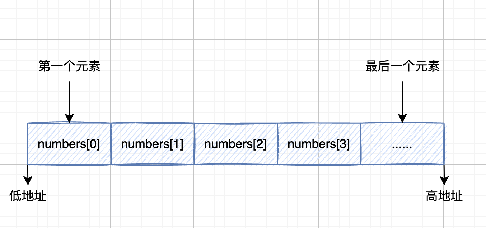
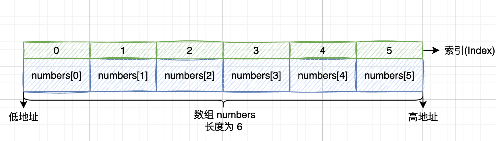
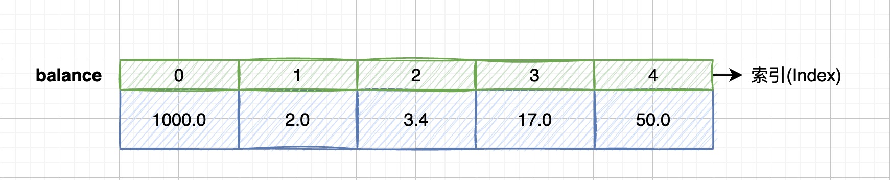
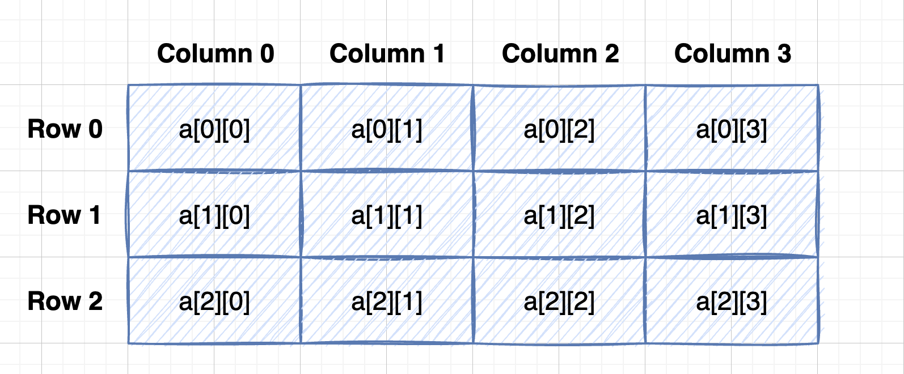

### C Arrays

C 编程语言提供了一种称为`数组`的数据结构，它可以存储相同类型元素的固定大小顺序集合。

数组是用于存储数据的集合，但将数组视为相同类型变量的集合通常更有用。

`数组的声明`并不是声明一个个单独的变量，比如number0、number1、 ... 、number99。而是声明一个数组变量，例如 numbers。然后使用 numbers[0]、numbers[1]、...、numbers[99]来表示一个个单独的变量。

所有数组都由连续的内存位置组成。最低地址对应于第一个元素，最高地址对应于最后一个元素。



数组中的特定元素(element)可以通过索引(index)访问，第一个索引值为 0。



#### (1)声明数组

在 C 中要声明一个数组，需要指定元素的类型和元素的数量，如下所示：

```c
type arrayName[arraySize];
```

这叫做`一维数组`。**arraySize**必须是一个大于零的整数常量，**type**可以是任意有效的 C 数据类型。

例如，要声明一个数据类型为 double 的，包含 5 个元素的数组**balance**(余额)，声明语句如下：

```c
double balance[5];
```

现在**balance**是一个可用的数组，它可以容纳 5 个类型为 double 的数字。

#### (2)初始化数组

在 C 中，你可以逐个初始化数组，也可以使用一个初始化语句，如下所示：

```c
double balance[5] =  {1000.0, 2.0, 3.4, 17.0, 50.0}
```

大括号{ } 之间的值的数目不能大于我们在数组声明时在 方括号[ ] 中指定的元素数目arraySize。

如果初始化数组时省略掉了数组的大小，那么，数组的大小则为初始化时元素的个数。因此，如果：

```c
double balance[] =  {1000.0, 2.0, 3.4, 17.0, 50.0}
```

那么，它将创建一个包含 5 个元素的数组**balance**，它与前一个实例中所创建的数组是完全相同的。

下面是一个为数组中某个元素赋值的实例：

```c
balance[4] = 50.0;
```

上述的语句把数组中第五个元素的值赋为50.0。所有的数组都是以0作为它们第一个元素的索引，0也被称为基索引，数组的最后一个索引是数组的总大小(arraySize)减去1。以下是上面所讨论的数组的的图形表示：



#### (3)访问数组的元素

数组元素可以通过`数组名称`加`索引`的形式进行访问。元素的索引是放在方括号内的，跟在数组名称的后边。例如：

```c
double salary = balance[3];
```

上面的语句将把数组中第 4 个元素的值赋给了 salary(薪水) 变量。

下面的第一个使用了上述的三个概念，即：声明数组、初始化数组、访问数组。

```c
#include <stdio.h>

int main(){
	int i;
	double balance[5] =  {1000.0, 2.0, 3.4, 17.0, 50.0};

	//输出数组中每个元素的值
	for(i = 0; i < 5; i++){
		printf("balance[%d] is: %.1f\n", i, balance[i]);
	}
	return 0;
}

```

运行结果：

```bash
$ gcc -o test1 test1.c
$ ./test1
balance[0] is: 1000.0
balance[1] is: 2.0
balance[2] is: 3.4
balance[3] is: 17.0
balance[4] is: 50.0
```

下面是第二个示例：

```c
#include <stdio.h>

int main(){
	int i, j;
	int n[10]; //n是一个包含10个整数元素的数组

	//初始化每一个数组元素
	for(i = 0; i < 10; i++){
		n[i] = 100 + i;  //设置元素的值为100+i
	}

	//输出数组中的每一个元素
	for(j = 0; j < 10; j++){
		printf("n[%d] is: %d.\n", j, n[j]);
	}

	return 0;
}
```

运行结果：

```bash
$ gcc -o test2 test2.c
$ ./test2
n[0] is: 100.
n[1] is: 101.
n[2] is: 102.
n[3] is: 103.
n[4] is: 104.
n[5] is: 105.
n[6] is: 106.
n[7] is: 107.
n[8] is: 108.
n[9] is: 109.
```

#### (4)多维数组

C语言支持多维数组(multidimensional arrays)，下面是多维数组声明的一般形式：

```c
type name[size1][size2]...[sizeN];
```

例如，下面声明创建了一个三维整数数组。

```c
int threedim[5][10][4];
```

**二维数组**

多维数组最简单的形式是二维数组(two-dimensional array)。二维数组本质上是一维数组的列表。

要声明一个大小为x, y的二维整数数组，可以编写如下内容：

```c
type arrayName[x][y];
```

其中，**type**可以是任意有效的 C 数据类型，**arrayName**是一个有效的C标识符。一个二维数组可以被认为是一个带有x行和y列的表格。

下面是一个二维数组，包含 3 行和 4 列：

```c
int a[3][4];
```



数组a中的每个元素都是由`a[i][j]`形式的元素标识的，其中a是数组的名称，i和j是唯一标识a中每个元素的下标。

**初始化二维数组**

多维数组可以通过在括号内为每行指定值来进行初始化。下面是一个带有 3 行 4 列的数组。

```c
int a[3][4] = {
    {0, 1, 2, 3},   //初始化索引号为 0 的行
    {4, 5, 6, 7},   //初始化索引号为 1 的行
    {8, 9, 10, 11}  //初始化索引号为 2 的行
};
```

内部嵌套的括号是可选的，下面的初始化与上面是等同的：

```c
 int a[3][4] = {0,1,2,3,4,5,6,7,8,9,10,11};
```

**访问二维数组元素**

二维数组中的元素是通过使用下标（即数组的行索引和列索引）来访问的。例如：

```c
int a[3][4] = {0,1,2,3,4,5,6,7,8,9,10,11};  //初始化二维数组a

int val = a[2][3];   //访问数组元素a[2][3]并将其赋值给变量val
```

下面的示例演示了如何通过嵌套循环来处理二维数组：

```c
#include <stdio.h>

int main(){

	/*
	int a[5][2] = {  
		{0, 0},
		{1, 2},
		{2, 4},
		{3, 6},
		{4, 8}
	}; */
	//int a[5][2] = {0, 0, 1, 2, 2, 4, 3, 6, 4, 8};
	
	int a[5][2] = {{0, 0}, {1, 2}, {2, 4}, {3, 6}, {4, 8}};  
	int i, j;

	for(i=0; i<5; i++){
		for(j=0; j<2; j++){
			printf("a[%d][%d] = %d\n", i, j, a[i][j]);
		}
	}

	return 0;
}
```

运行结果：

```bash
$ gcc -o test3 test3.c
$ ./test3
a[0][0] = 0
a[0][1] = 0
a[1][0] = 1
a[1][1] = 2
a[2][0] = 2
a[2][1] = 4
a[3][0] = 3
a[3][1] = 6
a[4][0] = 4
a[4][1] = 8
```

如上所述，你可以创建任意维度的数组，但是一般情况下，我们创建的数组是一维数组和二维数组。

#### (5)将数组作为函数参数传递

如果想要在函数中传递一个一维数组作为参数，你必须用以下面三种方式来声明函数`形式参数`，这三种声明方式的结果是一样的，因为每种方式都会告诉编译器将要接收一个整型指针。同样地，你也可以传递一个多维数组作为形式参数。

**方法一：**

形式参数是一个指针(这将在下一章中学习到有关指针的知识)。

```c
void myFunction(int *param){
    ...
    ...
}
```

**方法二：**

形式参数是一个已定义大小的数组。

```c
void myFunction(int param[10]){
	...
    ...
}
```

**方法三：**

形式参数是一个未定义大小的数组。

```c
void myFunction(int param[]){
	...
    ...
}
```

下面是一个示例，函数`getAverage()`，它将一个数组作为参数，同时还传递了另一个参数。根据所传的参数，函数会返回数组中元素的平均值。

```c
#include <stdio.h>

double getAverage(int arr[], int size);


double getAverage(int arr[], int size){
	int i;
	double avg;
	double sum = 0;

	for(i=0; i<size; i++){
		sum += arr[i];
	}
	avg = sum / size;

	return avg;
}


int main(){
	double avg;
	int balance[5] = {1000, 2, 3, 17, 50};

	avg = getAverage(balance, 5);

	printf("Average value is : %f\n", avg);

	return 0;
}
```

运行结果：

```bash
$ gcc -o test4 test4.c
$ ./test4
Average value is : 214.400000
```

可以看到，就函数而言，数组的长度是无关紧要的，因为 C 不会对形式参数执行边界检查。

#### (6)从函数返回数组

C语言不允许将整个数组作为参数返回给函数。但是，你可以通过指定不带索引的数组名称来返回指向数组的指针。你将在下一章学习指针，因此你可以跳过本章，直到你了解 C 中指针的概念。

如果要从函数返回一维数组，则必须声明一个返回指针的函数，如下例所示：

```c
int * myFunction(){
	...
	...
}
```

另外，C语言不提倡将局部变量的地址返回到函数外部，因此您必须将局部变量定义为静态变量(static)。

因为局部变量是存储在内存的栈区内，当函数调用结束后，局部变量所占的内存地址便被释放了，因此当其函数执行完毕后，函数内的变量便不再拥有那个内存地址，所以不能返回其指针。

除非将其变量定义为 static 变量，static 变量的值存放在内存中的静态数据区，不会随着函数执行的结束而被清除，故能返回其地址。

现在，让我们来看下面的函数，它会生成 10 个随机数，并使用数组来返回它们，具体如下：

```c
#include <stdio.h>
#include <stdlib.h>
#include <time.h>

int * getRandom(){
	static int value[10];
	int i;

	//设置种子(seed)
	srand((unsigned)time(NULL));
	//time(NULL)：返回自格林威治标准时间00:00:00小时以来经过的秒数。

	for(i=0; i<10; i++){
		value[i] = rand();
		printf("value[%d] = %d\n", i, value[i]);
	}

	return value;
}


int main(){
	int *p;
	int i;

	p = getRandom();

	printf("\n");
	printf("P+n = 指针P的地址 + n*sizeof(指针的类型).\n");
	for(i=0; i<10; i++){
		printf("(p+%d) is : %p\n", i, p+i);
	}

	printf("\n");
	for(i=0; i<10; i++){
		printf("*(p+%d) is : %d\n", i, *(p+i));
	}

	return 0;
}
```

需要注意的是：

`srand((unsigned)time(NULL))`的作用是是初始化种子(seed)。

①rand()和srand()要一起使用，其中srand()用来初始化随机数种子,rand()用来产生随机数。

②默认情况下随机数种子为1，而相同的随机数种子产生的随机数序列是一样的，这失去了随机性的意义，所以为了使每次得到的随机数不一样，就需要使用函数srand()初始化随机数种子。srand()的参数，一般用time函数值（即当前时间），因为每次调用rand()函数的时间通常是不同的，这样就可以保证随机性了。

③使用srand()函数时，参数可以是unsigned型的任意数据，比如srand(10)。

> rand()和srand()的用法可以参考：https://blog.csdn.net/candyliuxj/article/details/4396666#:~:text=rand()%E5%92%8Csrand()%E8%A6%81%E4%B8%80%E8%B5%B7%E4%BD%BF%E7%94%A8%EF%BC%8C%E5%85%B6%E4%B8%ADsrand,()%E5%88%9D%E5%A7%8B%E5%8C%96%E9%9A%8F%E6%9C%BA%E6%95%B0%E7%A7%8D%E5%AD%90%E3%80%82


运行结果：

```bash
$ gcc -o test5 test5.c
$ ./test5
value[0] = 1251415447
value[1] = 84579011
value[2] = 2032747210
value[3] = 65018347
value[4] = 1841665353
value[5] = 1187783660
value[6] = 71991108
value[7] = 921258895
value[8] = 241153395
value[9] = 763467876

P+n = 指针P的地址 + n*sizeof(指针的类型).
(p+0) is : 0x10a44e030
(p+1) is : 0x10a44e034
(p+2) is : 0x10a44e038
(p+3) is : 0x10a44e03c
(p+4) is : 0x10a44e040
(p+5) is : 0x10a44e044
(p+6) is : 0x10a44e048
(p+7) is : 0x10a44e04c
(p+8) is : 0x10a44e050
(p+9) is : 0x10a44e054

*(p+0) is : 1251415447
*(p+1) is : 84579011
*(p+2) is : 2032747210
*(p+3) is : 65018347
*(p+4) is : 1841665353
*(p+5) is : 1187783660
*(p+6) is : 71991108
*(p+7) is : 921258895
*(p+8) is : 241153395
*(p+9) is : 763467876
```

#### (7)指向数组的指针

在读完与 C 中的指针相关的章节之前，您很可能不会理解这一章。

如果你对 C 语言中指针的概念有所了解，那么就可以开始本章的学习。数组名是一个指向数组中第一个元素的常量指针。因此，在下面的声明中：

```c
double balance[50];
```

**balance** 是一个指向`&balance[0]`的指针，即数组balance的第一个元素的地址。因此，下面的代码把 **p** 赋值为 **balance** 的第一个元素的地址：

```c
double *p;
double balance;

p = balance;
```

使用数组名作为常量指针是合法的，反之亦然。因此，`*(balance + 4)`是一种访问`balance[4]`数据的合法方式。

一旦你把第一个元素的地址存储在 p 中，那么就可以使用`p`、`(p+1)`、`(p+2)` 等来访问数组元素。

下面的示例演示了上面讨论到的这些概念：

```c
#include <stdio.h>

int main(){
	int i;
	double *p;
	double balance[5] = {1000.0, 2.0, 3.4, 17.0, 50.0};

	p = balance;

	printf("1.Array values using balance.\n");
	for(i=0; i<5; i++){
		printf("balance[%d] : %f\n", i, balance[i]);
	}
	printf("\n");

	printf("2.Array values using balance as address.\n");
	for(i=0; i<5; i++){
		printf("*(balance + %d) : %f\n", i, *(balance+i));
	}
	printf("\n");

	printf("3.Array values using pointer.\n");
	for(i=0; i<5; i++){
		printf("*(p+%d) : %f\n", i, *(p+i));
	}	
	return 0;
}
```

运行结果：

```bash
$ gcc -o test6 test6.c
$ ./test6
1.Array values using balance.
balance[0] : 1000.000000
balance[1] : 2.000000
balance[2] : 3.400000
balance[3] : 17.000000
balance[4] : 50.000000

2.Array values using balance as address.
*(balance + 0) : 1000.000000
*(balance + 1) : 2.000000
*(balance + 2) : 3.400000
*(balance + 3) : 17.000000
*(balance + 4) : 50.000000

3.Array values using pointer.
*(p+0) : 1000.000000
*(p+1) : 2.000000
*(p+2) : 3.400000
*(p+3) : 17.000000
*(p+4) : 50.000000
```

在上面的实例中，p 是一个指向 double 类型的指针，这意味着它可以存储一个 double 类型的变量。一旦我们有了 p 中的地址，***p** 将给出存储在 p 中相应地址的值，正如上面实例中所演示的。

> **printf()**只会看到双精度数，**printf** 的 **%f** 格式总是得到 **double**，所以在 **printf()** 中使用 **%f** 跟 **%lf** 的输出显示效果是一样的。
>
> 但是对于变量来说，**double** 类型比 **float** 类型的精度要高。**double** 精度更高，是指它存储的小数位数更多，但是 printf 的输出默认都是 6 位小数，如果你想输出更多小数，可以自己控制，比如 **%.10lf** 就输出 10 位小数。
>
> 一般情况下 **double** 类型的占位符用 **%lf**。


