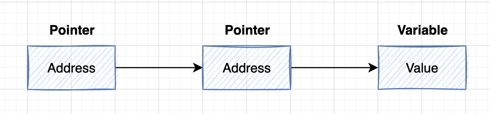
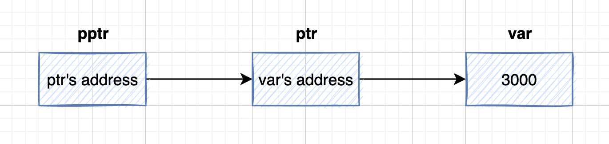

### C Pointers

C 语言中的指针(Pointer)学习起来既简单又有趣。通过指针，可以简化一些 C 编程任务的执行，还有一些任务，如动态内存分配，没有指针是无法执行的。所以，想要成为一名优秀的 C 程序员，学习指针是很有必要的。

正如您所知道的，每一个变量都有一个内存位置，每一个内存位置都定义了可使用 **&** 运算符访问的地址，它表示了在内存中的一个地址。

下面的代码将输出已定义的变量的地址：

```c
#include <stdio.h>

int main(){
	int var1;
	char var2;

	printf("Address of var1 variable: %p\n", &var1);
	printf("Address of var2 variable: %p\n", &var2);
	return 0;
}
```

运行结果：

```bash
$ gcc -o test1 test1.c
$ ./test1
Address of var1 variable: 0x7ff7b9b515c8
Address of var2 variable: 0x7ff7b9b515c7
```

通过上面的实例，我们了解了什么是内存地址以及如何访问它。接下来让我们看看什么是指针。

#### (1)什么是指针

在 C/C++语言中，指针一般被认为是`指针变量`，指针变量的内容存储的是其指向的对象的首地址，指向的对象可以是变量，数组，函数等占据存储空间的实体。

和任何变量或常量一样，你必须先声明一个指针，然后才能使用它来存储任何变量地址。

指针变量声明的一般形式是：

```c
type *var_name;
```

在这里，**type** 是指针的数据类型，它必须是一个有效的 C 数据类型。**var_name** 是指针变量的名称。用来声明指针的星号 ***** 与乘法中使用的星号是相同的。但是，在这个语句中，星号是用来指定一个变量是指针。

以下是有效的指针声明：

```c
int    *ip;  //指向int类型的指针变量ip
double *dp;  //指向double类型的指针变量dp
float  *fp;  //指向float类型的指针变量fp
char   *ch;  //指向char类型的指针变量ch
```

所有实际数据类型，不管是整型(int)、浮点型(float)、字符型(char)，还是其他的数据类型，对应指针的值的类型都是一样的，都是一个代表内存地址的长的十六进制数。

不同数据类型的指针之间唯一的不同是，指针所指向的变量或常量的数据类型不同。

#### (2)如何使用指针

使用指针时会频繁进行以下几个操作：①定义一个指针变量、②把变量地址赋值给指针、③访问指针变量中可用地址的值。这些是通过使用一元运算符`*`来返回位于操作数所指定地址的变量的值。下面的实例涉及到了这些操作：

```c
#include <stdio.h>

int main(){

	int var = 20;
	int *ip;

	ip = &var;

	printf("Address of var variable: %p\n", &var);

	printf("Address stored in ip variable: %p\n", ip);

	printf("Value of *ip variable: %d\n", *ip);	

	return 0;
}
```

运行结果：

```bash
$ gcc -o test2 test2.c
$ ./test2
Address of var variable: 0x7ff7b933c5c8
Address stored in ip variable: 0x7ff7b933c5c8
Value of *ip variable: 20
```

#### (3)C中的NULL指针

在变量声明的时候，如果没有确切的地址可以赋值，为指针变量赋一个 NULL 值是一个良好的编程习惯。赋为 NULL 值的指针被称为`空指针`。

空指针是一个定义在标准库中的值为零的常量。请看下面的程序：

```c
#include <stdio.h>

int main(){
	int *ptr = NULL;

	printf("The Value of ptr is : %p \n", ptr);

	return 0;
}
```

运行结果：

```
$ gcc -o test3 test3.c
$ ./test3
The Value of ptr is : 0x0
```

在大多数的操作系统上，程序不允许访问地址为 0 的内存，因为该内存是操作系统保留的。然而，内存地址 0 有特别重要的意义，它表明该指针不指向一个可访问的内存位置。但按照惯例，如果指针包含空值（零值），则假定它不指向任何东西。

如需检查一个空指针，您可以使用 if 语句，如下所示：

```c
if(ptr)     /* succeeds if p is not null */
if(!ptr)    /* succeeds if p is null */
```

#### (4)指针的算术运算

C指针是一个用数值表示的地址。因此，你可以对指针执行算术运算。可以对指针进行四种算术运算：`++`、`--`、`+`、`-`。

假设 **ptr** 是一个指向地址 1000 的`整型指针`，是一个 32 位的整数，让我们对该指针执行下列的算术运算：

```c
ptr++;
```

在执行完上述的运算之后，**ptr** 将指向位置 1004，因为 ptr 每增加一次，它都将指向下一个整数位置，即当前位置往后移 4 字节。这个运算会在不影响内存位置中实际值的情况下，移动指针到下一个内存位置。如果 **ptr** 指向一个地址为 1000 的 char 型字符，上面的运算会导致指针指向位置 1001，因为下一个字符位置是在 1001。

简单概括一下就是：

- 指针的每一次递增，它其实会指向下一个元素的存储单元。
- 指针的每一次递减，它都会指向前一个元素的存储单元。
- 指针在递增和递减时跳跃的字节数取决于指针所指向变量数据类型长度，比如 int 就是 4 个字节。

#### (5)递增指针

我们喜欢在程序中使用指针代替数组，因为变量指针可以递增，而数组不能递增，数组可以看成一个指针常量。下面的程序递增变量指针，以便顺序访问数组中的每一个元素：

```c
#include <stdio.h>

const int MAX = 3;

int main(){
	int var[] = {10, 100, 200};
	int i, *ptr;

	ptr = var;  //指针中第一个元素的地址

	for(i=0; i<MAX; i++){
		printf("Address of var[%d] = %p\n", i, ptr);
		printf("Value of var[%d] = %d\n", i, *ptr);
		printf("\n");
		ptr++;
	}

	return 0;
}
```

运行结果：

```bash
$ gcc -o test4 test4.c
$ ./test4
Address of var[0] = 0x7ff7b7e4a5bc
Value of var[0] = 10

Address of var[1] = 0x7ff7b7e4a5c0
Value of var[1] = 100

Address of var[2] = 0x7ff7b7e4a5c4
Value of var[2] = 200
```

#### (6)递减指针

同样地，对指针进行递减运算，即把值减去其数据类型的字节数，如下所示：

```c
#include <stdio.h>

const int MAX = 3;


int main(){
	int var[] = {10, 100, 200};
	int i, *ptr;

	ptr = &var[MAX-1];  //指针中最后一个元素的地址
    
	for(i=MAX; i>0; i--){
		printf("Address of var[%d] = %p\n", i, ptr);
		printf("Value of var[%d] = %d\n", i, *ptr);
		printf("\n");
		ptr--;
	}

	return 0;
}
```

运行结果：

```
$ gcc -o test5 test5.c
$ ./test5
Address of var[3] = 0x7ff7b5b3c5c4
Value of var[3] = 200

Address of var[2] = 0x7ff7b5b3c5c0
Value of var[2] = 100

Address of var[1] = 0x7ff7b5b3c5bc
Value of var[1] = 10
```

#### (7)指针的比较

指针可以用关系运算符进行比较，如 `==`、`<` 和 `>`。如果 p1 和 p2 指向两个相关的变量，比如同一个数组中的不同元素，则可对 p1 和 p2 进行大小比较。

下面的程序修改了上面的实例，只要变量指针所指向的地址小于或等于数组的最后一个元素的地址 &var[MAX - 1]，则把变量指针进行递增：

```c
#include <stdio.h>

const int MAX = 3;


int main(){
	int var[] = {10, 100, 200};
	int i, *ptr;

	ptr = var; //指针中第一个元素的地址
	i = 0;

	while(ptr <= &var[MAX-1]){
		printf("Address of var[%d] = %p\n", i, ptr);
		printf("Value of var[%d] = %d\n", i, *ptr);
		printf("\n");

		//point to the previous location
		ptr++;
		i++;
	}

	return 0;
}
```

运行结果：

```c
$ gcc -o test6 test6.c
$ ./test6
Address of var[0] = 0x7ff7b8f995bc
Value of var[0] = 10

Address of var[1] = 0x7ff7b8f995c0
Value of var[1] = 100

Address of var[2] = 0x7ff7b8f995c4
Value of var[2] = 200
```

#### (8)指针数组

在我们讲解指针数组的概念之前，先让我们来看一个实例，它用到了一个由 3 个整数组成的数组：

```c
#include <stdio.h>

const int MAX = 3;


int main(){
	int var[] = {10, 100, 200};
	int i;

	for(i=0; i<MAX; i++){
		printf("Value of var[%d] = %d\n", i, var[i]);
	}

	return 0;
}
```

运行结果：

```bash
$ gcc -o test7 test7.c
$ ./test7
Value of var[0] = 10
Value of var[1] = 100
Value of var[2] = 200
```

可能有这么一种情况，我们想要让数组来存储指向 int 或 char 或其他数据类型的指针。

下面是一个`指向整数的指针数组`的声明：

```c
int *ptr[MAX];
```

在这里，把 **ptr** 声明为一个数组，由 MAX 个整数指针组成。因此，ptr 中的每个元素，都是一个指向 int 值的指针。下面的实例用到了三个整数，它们将存储在一个指针数组中，如下所示：

```c
#include <stdio.h>

const int MAX = 3;

int main(){
	int var[] = {10, 100, 200};
	int i;
	int *ptr[MAX];

	//assign the address of integer.
	for(i=0; i<MAX; i++){
		ptr[i] = &var[i];
	}
	for(i=0; i<MAX; i++){
		printf("Value of var[%d] = %d\n", i, *ptr[i]);
	}

	return 0;
}
```

运行结果：

```bash
$ gcc -o test8 test8.c
$ ./test8
Value of var[0] = 10
Value of var[1] = 100
Value of var[2] = 200
```

你也可以用一个`指向字符的指针数组`来存储一个字符串列表，如下：

```c
#include <stdio.h>

const int MAX = 4;

int main(){
	char *names[] = {"Zara Ali", "Hina Ali", "Nuha Ali", "Sara Ali"};
	int i;

	for(i=0; i<MAX; i++){
		printf("Value of names[%d] = %s\n", i, names[i]);
	}

	return 0;
}
```

运行结果：

```bash
$ gcc -o test9 test9.c
$ ./test9
Value of names[0] = Zara Ali
Value of names[1] = Hina Ali
Value of names[2] = Nuha Ali
Value of names[3] = Sara Ali
```

#### (9)指向指针的指针

指向指针的指针是一种多级间接寻址的形式，或者说是一个指针链。通常，一个指针包含一个变量的地址。当我们定义一个指向指针的指针时，第一个指针包含了第二个指针的地址，第二个指针指向包含实际值的位置。



一个指向指针的指针变量必须如下声明，即在变量名前放置两个星号。例如，下面声明了一个指向 int 类型指针的指针：

```c
int **var;
```

当一个目标值被一个指针间接指向到另一个指针时，访问这个值需要使用两个星号运算符，如下面实例所示：

```c
#include <stdio.h>

int main(){
	int var;
	int *ptr;
	int **pptr;

	var = 3000;

	ptr = &var;   //存放变量var的地址

	pptr = &ptr;  //存放指针变量ptr的地址

	printf("Value of var = %d\n", var);
	printf("Value available at *ptr = %d\n", *ptr);
	printf("Value available at **pptr = %d\n", **pptr);
	return 0;
}
```



运行结果：

```c
$ gcc -o test10 test10.c
$ ./test10
Value of var = 3000
Value available at *ptr = 3000
Value available at **pptr = 3000
```

#### (10)将指针传递给函数

C 语言允许传递指针给函数，只需要简单地声明函数参数为指针类型即可。

下面的实例中，我们传递一个无符号的 long 型指针给函数，并在函数内改变这个值：

```c
#include <stdio.h>
#include <time.h>

void getSeconds(unsigned long *ptr);

int main(){
	unsigned long sec;

	getSeconds(&sec);

	printf("Number of seconds: %ld\n", sec);

	return 0;
}

void getSeconds(unsigned long *ptr){
	*ptr = time(NULL);
	return;
}
```

运行结果：

```bash
$ gcc -o test11 test11.c
$ ./test11
Number of seconds: 1665302133
```

能接受指针作为参数的函数，也能接受数组作为参数，如下所示：

```c
#include <stdio.h>

double getAverage(int *arr, int size);

int main(){
	int balance[5] = {1000, 2, 3, 17, 50};
	double avg;

	avg = getAverage(balance, 5);

	printf("Average value is: %f\n", avg);

	return 0;
}

double getAverage(int *arr, int size){
	int i;
	int sum = 0;
	double avg;

	for(i=0; i<size; i++){
		sum += arr[i];
	}
	avg = (double)sum / size;
	return avg;
}
```

运行结果：

```bash
$ gcc -o test12 test12.c
$ ./test12
Average value is: 214.400000
```

#### (11)从函数返回指针

在上一章中，我们已经了解了 C 语言中如何从函数返回数组，类似地，C 允许从函数返回指针。为了做到这点，必须声明一个返回指针的函数，如下所示：

```c
int * myFunction{
    ...
    ...
}
```

另外，C 语言不支持在调用函数时返回局部变量的地址，除非定义局部变量为 **static** 变量。

因为局部变量是存储在内存的栈区内，当函数调用结束后，局部变量所占的内存地址便被释放了，因此当其函数执行完毕后，函数内的变量便不再拥有那个内存地址，所以不能返回其指针。

除非将其变量定义为 static 变量，static 变量的值存放在内存中的静态数据区，不会随着函数执行的结束而被清除，故能返回其地址。


现在，让我们来看下面的函数，它会生成 10 个随机数，并使用表示指针的数组名（即第一个数组元素的地址）来返回它们，具体如下：

```c
#include <stdio.h>
#include <stdlib.h>
#include <time.h>

int * getRandom(){
	static int value[10];
	int i;

	//设置种子(seed)
	srand((unsigned)time(NULL));
	//time(NULL)：返回自格林威治标准时间00:00:00小时以来经过的秒数。

	for(i=0; i<10; i++){
		value[i] = rand();
		printf("value[%d] = %d\n", i, value[i]);
	}

	return value;
}


int main(){
	int *p;
	int i;

	p = getRandom();

	printf("\n");
	printf("P+n = 指针P的地址 + n*sizeof(指针的类型).\n");
	for(i=0; i<10; i++){
		printf("(p+%d) is : %p\n", i, p+i);
	}

	printf("\n");
	for(i=0; i<10; i++){
		printf("*(p+%d) is : %d\n", i, *(p+i));
	}

	return 0;
}
```

运行结果：

```c
#include <stdio.h>
#include <time.h>
#include <stdlib.h>

int * getRandom(){
	static int value[10];
	int i;

	//设置种子(seed)
	srand((unsigned)time(NULL));
	//time(NULL)：返回自格林威治标准时间00:00:00小时以来经过的秒数。

	for(i=0; i<10; i++){
		value[i] = rand();
		printf("value[%d] = %d\n", i, value[i]);
	}
	return value;
}

int main(){
	int i;
	int *p;

	p = getRandom();

	printf("\n");
	for(i=0; i<10; i++){
		printf("(p+%d) is : %p\n", i, p+i);
	}

	printf("\n");
	for(i=0; i<10; i++){
		printf("*(p+%d) is : %d\n", i, *(p+i));
	}

	return 0;
}
```

运行结果；

```bash
$ gcc -o test13 test13.c
$ ./test13
value[0] = 605099426
value[1] = 1570984237
value[2] = 220631394
value[3] = 1595064236
value[4] = 1206248951
value[5] = 1180491777
value[6] = 2071365053
value[7] = 575044254
value[8] = 1092365478
value[9] = 548890543

(p+0) is : 0x10a985030
(p+1) is : 0x10a985034
(p+2) is : 0x10a985038
(p+3) is : 0x10a98503c
(p+4) is : 0x10a985040
(p+5) is : 0x10a985044
(p+6) is : 0x10a985048
(p+7) is : 0x10a98504c
(p+8) is : 0x10a985050
(p+9) is : 0x10a985054

*(p+0) is : 605099426
*(p+1) is : 1570984237
*(p+2) is : 220631394
*(p+3) is : 1595064236
*(p+4) is : 1206248951
*(p+5) is : 1180491777
*(p+6) is : 2071365053
*(p+7) is : 575044254
*(p+8) is : 1092365478
*(p+9) is : 548890543
```

### 