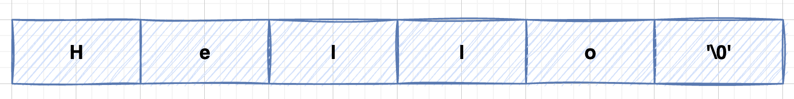

### C Strings

C 语言中的字符串实际上是一个以空字符`\0`结尾的一维字符数组。因此，`\0`用于标记字符串的结束。

**空字符（Null character**）又称结束符，缩写 **NUL**，是一个数值为 **0** 的控制字符，`\0`是转义字符，意思是告诉编译器，这不是字符 **0**，而是空字符。

以下声明和初始化创建了一个由单词"Hello"组成的字符串。为了在数组末尾保存空字符，包含字符串的字符数组的大小比单词"Hello"中的字符数大一。

```c
char greeting[6] = {'H', 'e', 'l', 'l', 'o', '\0'};
```

依据数组初始化规则，您可以把上面的语句写成以下语句：

```c
char greeting[] = "Hello";
```

以下是上面定义的字符串在 C/C++ 中的内存表示：



> 图中'\0'两侧的单引号，仅仅是为了突出这是一个字符`\0`。

实际上，您不需要将空字符放在字符串常量的末尾。 C编译器在初始化数组时会自动将`\0`放在字符串的末尾。让我们尝试打印上面提到的字符串：

```c
#include <stdio.h>

int main(){
	char greeting[6] = {'H', 'e', 'l', 'l', 'o', '\0'};
	printf("Greeting message: %s\n", greeting);

	return 0;
}
```

运行结果：

```bash
$ gcc -o test1 test1.c
$ ./test1
Greeting message: Hello
```

请注意区分：

```c
//字符数组
char greeting[6] = {'H', 'e', 'l', 'l', 'o', '\0'};
char greeting[] = "Hello";

//指向字符的指针数组
char *names[] = {"Zara Ali", "Hina Ali", "Nuha Ali", "Sara Ali"};
```


C 支持广泛的函数来操作字符串：

| 函数           | 功能                                                         |
| -------------- | ------------------------------------------------------------ |
| strcpy(s1, s2) | 复制字符串 s2 到字符串 s1 中。                               |
| strcat(s1, s2) | 连接字符串 s2 到字符串 s1 的末尾。                           |
| strlen(s1)     | 返回字符串 s1 的长度。                                       |
| strcmp(s1, s2) | 字符串比较。<br>如果 s1 = s2 则返回值等于0；<br/>如果 s1 < s2 则返回值小于0；<br/>如果 s1 > s2 则返回值大于0。 |
| strchr(s1, ch) | 返回一个指针，该指针指向字符串 s1 中`字符ch`第一次出现的位置。 |
| strstr(s1, s2) | 返回一个指针，该指针指向字符串 s1 中`字符串s2`第一次出现的位置。 |

下面的实例使用了上述的一些函数：

```c
#include <stdio.h>
#include <string.h>

int main(){

	int len;
	char str1[12] = "Hello";
	char str2[12] = "World";
	char str3[12];

	strcpy(str3, str1);  
	printf("1.strcpy(str3, str1), str3 is %s.\n", str3);
    //str3 : Hello

	strcat(str1, str2);  
	printf("2.strcat(str1, str2), str1 is %s.\n", str1);
    //str1 : HelloWorld

	len = strlen(str1);
	printf("3.strlen(str1), length of str1 is %d.\n", len);

	return 0;
}
```

运行结果：

```bash
$ gcc -o test2 test2.c
$ ./test2
1.strcpy(str3, str1), str3 is Hello.
2.strcat(str1, str2), str1 is HelloWorld.
3.strlen(str1), length of str1 is 10.
```

您可以在 C 标准库中找到更多字符串相关的函数。