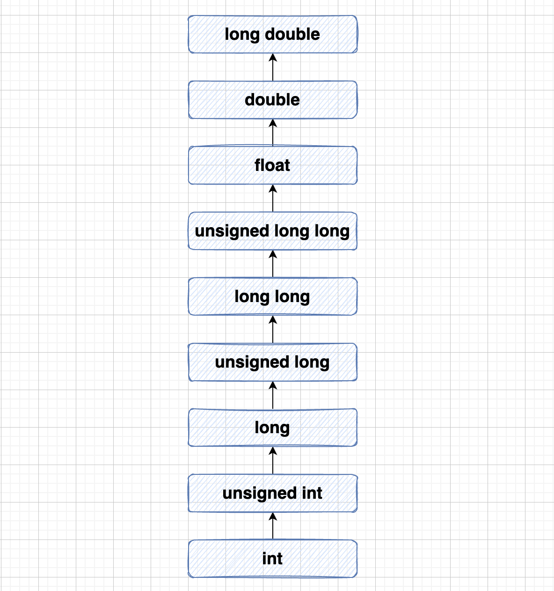

### Type Casting

强制类型转换(Type Casting)是把变量从一种数据类型转换为另一种数据类型。例如，如果你想存储一个 long 类型的值到一个简单的整型中，您需要把 long 类型强制转换为 int 类型。您可以使用`强制类型转换运算符`来把值显式地从一种类型转换为另一种类型，如下所示：

```c
(type_name) expression
```

请看下面的实例，使用`强制类型转换运算符`把一个整数变量除以另一个整数变量，得到一个浮点数：

```c
#include <stdio.h>

int main(){

    int count = 5;
    int sum = 17;
    double mean;

    mean = (double) sum / count;

    printf("Value of mean : %f\n", mean);
    
    return 0;
}
```

运行结果：

```bash
$ gcc -o test1 test1.c
$ ./test1
Value of mean : 3.400000
```

这里要注意的是`强制类型转换运算符`的优先级大于除法，因此 **sum** 的值首先被转换为 **double** 型，然后除以 count，得到一个类型为 double 的值。

类型转换可以是隐式的，由编译器自动执行，也可以是显式的，通过使用`强制类型转换运算符`来指定。

在编程时，有需要类型转换的时候都要用上`强制类型转换运算符`，是一种良好的编程习惯。

#### (1)整数提升

整数提升(Integer Promotion)是指把小于 **int** 或 **unsigned int** 的整数类型转换为 **int** 或 **unsigned int** 的过程。请看下面的实例，在 int 中添加一个字符：

```c
#include <stdio.h>

int main(){

	int i = 17;
	char c = 'c'; //ascii 'c', value is 99
	int sum;

	sum = i + c;

	printf("Value of sum : %d\n", sum);

	return 0;
}
```

运行结果：

```bash
$ gcc -o test2 test2.c
$ ./test2
Value of sum : 116
```

在这里，sum 的值为 116，因为编译器进行了整数提升，在执行实际加法运算时，把 'c' 的值转换为对应的 ascii 值。

#### (2)常用的算数转换

`常用的算术转换`是隐式地把值强制转换为相同的类型。编译器首先执行**整数提升**，如果操作数类型不同，则它们会被转换为下列层次中出现的最高层次的类型：



常用的算术转换不适用于赋值运算符、逻辑运算符 && 和 ||。

让我们看看下面的实例来理解这个概念：

```c
#include <stdio.h>

int main(){

	int i = 17;
	char c = 'c'; //ascii 'c', value is 99
	float sum;

	sum = i + c; 

	printf("Value of sum : %f\n", sum);

	return 0;
}
```

运行结果：

```bash
$ gcc -o test3 test3.c
$ ./test3
Value of sum : 116.000000
```

在这里，c 首先被转换为整数，但是由于最后的值是 float 型的，所以会采用常用的算术转换，编译器会把 i 和 c 转换为浮点型，并把它们相加得到一个浮点数。

