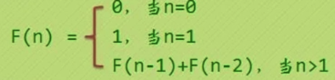

### Recursion

`递归(Recursion)`指的是在函数的定义中使用函数自身的方法。

递归的语法格式如下：

```c
void recursion()
{
   recursion();  //function calls itself
}

int main() {
   recursion();
}
```

C 语言支持递归，即一个函数可以调用其自身。但在使用递归时，程序员需要注意定义一个从函数退出的条件，否则会进入死循环。

递归函数对于解决许多数学问题非常有用，例如计算数字的阶乘、生成斐波那契数列等。

#### (1)数的阶乘

下面的示例使用递归函数计算一个给定的数的阶乘：

```c
#include <stdio.h>

int factorial(unsigned int i){
	if(i <= 1){
		return 1;
	}
	return i * factorial(i-1);
}

int main(){

	int i = 15;

	printf("Factorial of %d is %d\n", i, factorial(i));

	return 0;
}
```

运行结果：

```bash
$ gcc -o test1 test1.c
$ ./test1
Factorial of 15 is 2004310016
```

#### (2)斐波那契数列

斐波那契数列（Fibonacci sequence），又称黄金分割数列，因数学家莱昂纳多·斐波那契（Leonardo Fibonacci）以兔子繁殖为例子而引入，故又称为"兔子数列"，指的是这样一个数列：1、1、2、3、5、8、13、21、34、……在数学上，斐波那契数列以如下被以递推的方法定义：F(0)=0，F(1)=1, F(n)=F(n - 1)+F(n - 2)（n ≥ 2，n ∈ N*）在现代物理、准晶体结构、化学等领域，斐波那契数列都有直接的应用，为此，美国数学会从 1963 年起出版了以《斐波那契数列季刊》为名的一份数学杂志，用于专门刊载这方面的研究成果。



示例代码：

```c
#include <stdio.h>

int fibonaci(int i){
	if(i == 0){
		return 0;
	}
	if(i == 1){
		return 1;
	}
	return fibonaci(i-1) + fibonaci(i-2);
}


int main(){

	int i;

	for (int i = 0; i < 10; i++)
	{
		printf("%d\n", fibonaci(i));
	}

	return 0;
}
```

运行结果：

```bash
$ gcc -o test2 test2.c
$ ./test2
0
1
1
2
3
5
8
13
21
34
```


